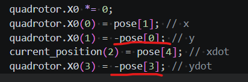
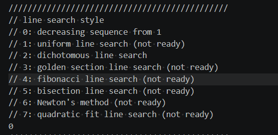
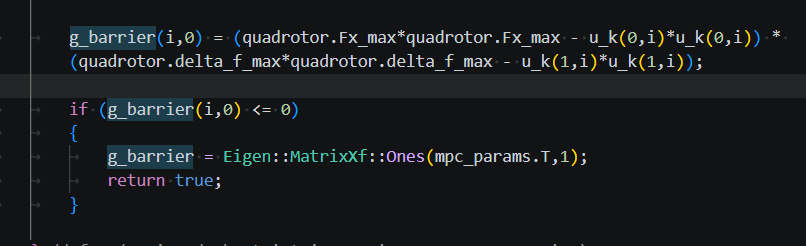
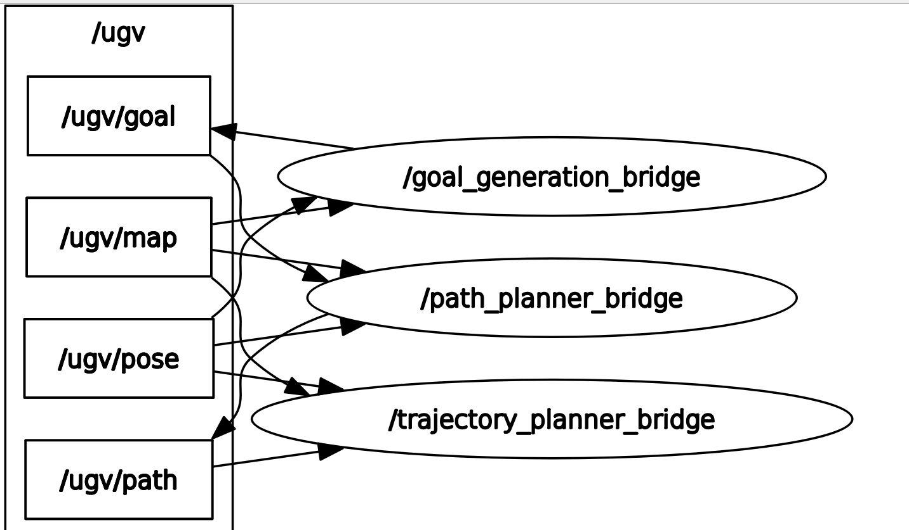

# Tactical-UGV
Tactical UGV codebase with MPC controller for Roboracer platform

## Compile and Run 

## Refactor from the original UAV codebase

`trajectory_planner/` originated as a quadrotor (UAV) feedback-linearized MPC controller. It has
been converted to drive a planar ground vehicle (UGV) instead: the state was reduced from the
UAV's 14-state position/velocity/acceleration/jerk-plus-heading flat-output model to a 4-state
planar model `chi = [x, y, xdot, ydot]`, controls were changed from `[thrust, roll, pitch, yaw]`
to a bicycle-model `[F_x, delta_f]` (longitudinal force, front steering angle), and the
feedback-linearization law was re-derived from the exact non-linear tire-slip equations in
[`ugv_feedback_linearization_state_space.md`](trajectory_planner/trajectory_planner/ugv_feedback_linearization_state_space.md)
in place of the quadrotor's rotational-kinematics/thrust-chain derivation. All of the
quadrotor-only machinery (rotor mixer, thrust dynamic extension, Euler-angle/Gamma-matrix
kinematics, camera-FOV heading constraint, altitude ceiling) was removed; the parameter files
were resized and repopulated with placeholder RC-car-scale values to match.

### Line-level diff vs. the original UAV codebase

Measured with `git diff --stat` against the committed pre-refactor baseline.

| File | Original lines | Current lines | Diff churn (+/&minus;) |
|---|---:|---:|---:|
| `src/f_mpc_uncut/f_mpc_trajectory.cpp` | 1,789 | 1,747 | 3,536 |
| `src/f_mpc_uncut/f_mpc_solver.cpp` | 1,529 | 1,192 | 587 |
| `src/f_mpc_uncut/f_mpc_feedback_linearization.cpp` | 494 | 141 | 635 |
| `src/f_mpc_uncut/f_mpc_model.cpp` | 1,234 | 1,034 | 292 |
| `include/structures.h` | 438 | 418 | 68 |
| `include/f_mpc_uncut.h` | 206 | 175 | 51 |
| `src/line_search/line_search.cpp` | 227 | 223 | 28 |
| `src/f_mpc_uncut/f_mpc_communication.cpp` | 629 | 629 | 2 |
| **Total (source/headers)** | **6,546** | **5,559** | **5,199** (2,106 insertions, 3,093 deletions) |

Plus the two parameter files, whose content is data rather than code:

| File | Diff churn (+/&minus;) |
|---|---:|
| `build/Parameter_Files/System_params.txt` | 184 (63 insertions, 121 deletions) |
| `build/Parameter_Files/MPC_params.txt` | 99 (27 insertions, 72 deletions) |

**Grand total: ~5,482 lines changed across 10 files**, out of ~6,546 original lines in the 8
source/header files.

Notes on reading these numbers:
- "Diff churn" is insertions+deletions from `git diff`, which double-counts a line that was
  rewritten in place (removed, then a different line added) &mdash; it is the standard measure
  of edit volume, not a literal file-length change.
- `f_mpc_trajectory.cpp`'s 3,536 churn against only 1,789 original lines means it was rewritten
  line-by-line internally (state-index fixes throughout the waypoint/obstacle/segment-planning
  logic) even though its final length barely moved.
- `f_mpc_feedback_linearization.cpp` shrank by more than half (494&rarr;141): the quadrotor
  rotational-kinematics/thrust-chain machinery (Gamma matrix, angular-velocity integration,
  hat operator) was deleted outright rather than adapted, since the UGV control law is purely
  algebraic and needs none of it.
- `f_mpc_communication.cpp`'s 2-line churn is a single hardcoded-path bug fix unrelated to the
  UGV conversion &mdash; the rest of that file was already dimension-generic.

## Questions (Temp, will remove once resolved)
### Negative Pose?

[Neg pose](tactical_ugv_autonomous_stack/src/trajectory_planner/src/f_mpc_uncut/f_mpc_trajectory.cpp#246-251)
  <figure><figcaption>The initial conditions (Reinitilized per loop from current pose in previous loop) are negative for the y-pos and y-vel pose data. May be an artifact due to code refactor and held true only for UAV pose, will investigate during testing. </figcaption></figure>.

---

### Line Search?

[Parameter Line](tactical_ugv_autonomous_stack/src/trajectory_planner/build/Parameter_Files/MPC_params.txt#60)
  <figure><figcaption>Which of these options is the most reasonable? </figcaption></figure>.

---

<!-- ### $g_{barrier}$ form?

[$g_{barrier}$](tactical_ugv_autonomous_stack/src/trajectory_planner/src/f_mpc_uncut/f_mpc_feedback_linearization.cpp#125-132)
  <figure><figcaption>Is g_barrier constructed correctly? </figcaption></figure>.

--- -->

### Camera integration?

  <figure><figcaption>This architecture is configured for simulation. Is this just a static map dimension input? If so, does removing affect the rest of the code architecture? </figcaption></figure>.

  There is currently no configuration for a camera input. I originally thought that goal generation code was meant to voxelize the camera input but it seems to voxelize the entire hardcoded map? I may need to dig into this some more but my main question is whether I should:
  1. Voxelize continuous stream of point cloud data from camera (Octree algo?) with no hard boundary so the UGV can explore freely?
  2. Keep the map structure so the exporation area is bounded as the UAV sim was with the walled in space?
