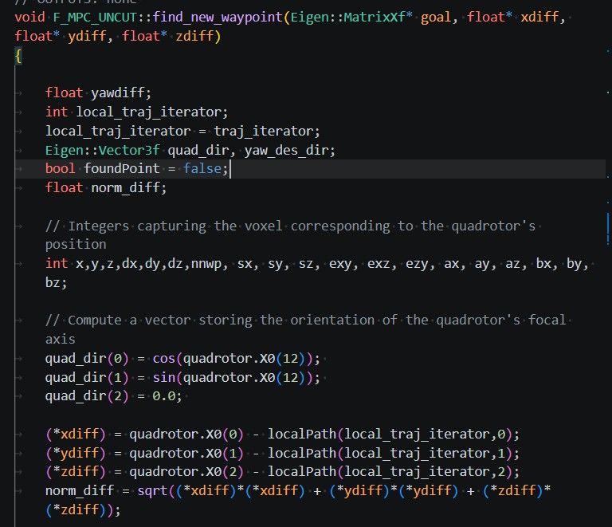
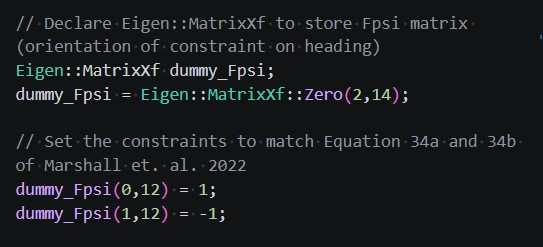
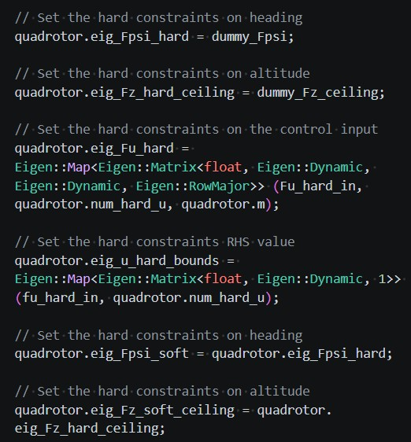

# Tactical-UGV
Tactical UGV codebase for Roboracer platform

[Roboracer website](https://f1tenth.readthedocs.io/en/stable/)

## Table of Contents
1. [Overview](#overview)
1. [Features](#features)
1. [System Architecture](#system-architecture)
1. [Installation](#installation)
1. [Notes](#notes)

## Overview
The source code for the trajectory planner computes feasible trajectories with real time constraints for a tactical UGV. The path planner determines the waypoints for interpolation based on camera inputs. Ray tracing is used to determine the set of unoccupied voxels and waypoints are chosen both to avoid obstacles and keep the UGV close to objects for tactical advantage. The codebase is equipped with a ROS2 framework and libraries for simulation within pychrono.

This codebase is a modification of a real time MPC framework implementation for quadrotors. The paper with details about the theory and implementation can be found [here](https://lafflitto.com/Documents/LAfflitto_Tactical_Coverage.pdf)

## Features
* **Efficient Constraints** - Hard and soft constraints can be set based Boyds paper [here](https://www-leland.stanford.edu/~boyd/papers/pdf/fast_mpc.pdf)

## System Architecture

## Installation

## Notes
* There will be a large tearup of `find_new_waypoint`. The UGV does not need to worry about z coordinates.

* Indexing for UAV - needs to be changed for 4 (eventually 6+ state system)
* Z ceiling not necessary for UGV
* Best way to swap fpsi soft and hard constraints and z ceiling?

